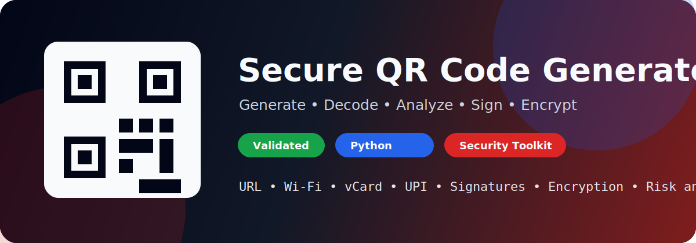
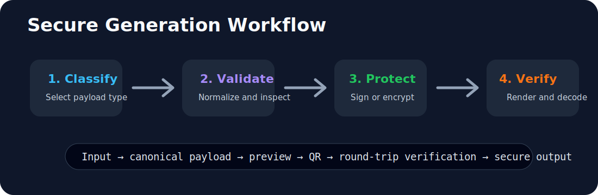
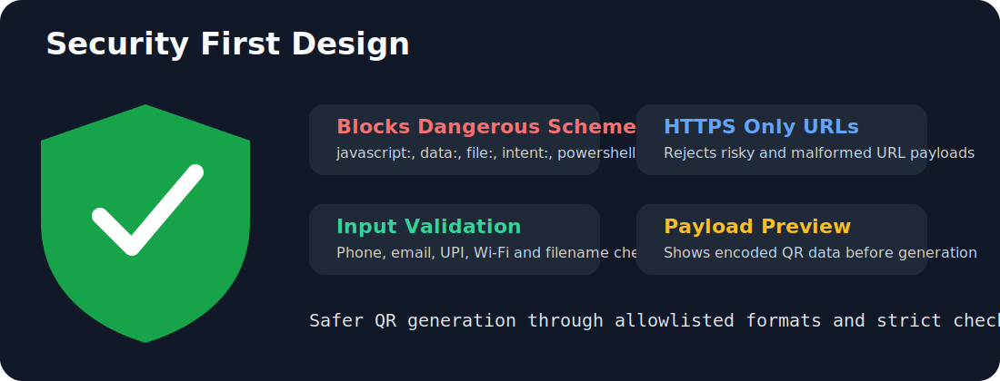

# Secure QR Code Generator

<p align="center">
  
</p>

<p align="center">
  <b>A secure cross-platform Python QR Code Generator for Windows, Linux, and Kali Linux.</b>
</p>

<p align="center">
  
  
  
  
</p>

---

## Overview

**Secure QR Code Generator** is a terminal-based Python tool that generates QR codes for multiple real-world use cases while applying a security validation layer before generating the final QR image.

A normal QR generator blindly converts any input into a QR code. This project is different. It validates the selected QR type, blocks dangerous URI schemes, rejects risky URLs, checks phone numbers, validates UPI IDs, prevents unsafe filenames, and shows a payload preview before generating the QR code.

This makes the project useful for:

* Cybersecurity learners
* Python beginners
* Kali Linux users
* Windows users
* GitHub portfolio projects
* Utility scripting
* Safe QR code generation

---

## Supported QR Types

| QR Type            | Payload Format                   | Purpose                    |
| ------------------ | -------------------------------- | -------------------------- |
| Safe Text QR       | Plain text                       | Store controlled text data |
| HTTPS URL QR       | `https://example.com`            | Open safe public web URLs  |
| Phone Call QR      | `tel:number`                     | Open phone dialer          |
| SMS QR             | `sms:number?body=message`        | Open SMS app with message  |
| Email QR           | `mailto:user@example.com`        | Open email composer        |
| WhatsApp QR        | `https://wa.me/number`           | Open WhatsApp chat         |
| Wi-Fi QR           | `WIFI:T:WPA;S:ssid;P:password;;` | Connect to Wi-Fi           |
| Contact / vCard QR | `BEGIN:VCARD...`                 | Save contact details       |
| UPI Payment QR     | `upi://pay?...`                  | Open UPI payment app       |

---

## How It Works

<p align="center">
  
</p>

The workflow is simple:

```text
User selects QR type
        ↓
User enters required data
        ↓
Input validation is applied
        ↓
Unsafe payloads are blocked
        ↓
Payload preview is shown
        ↓
QR code is generated
        ↓
PNG file is saved inside output/
```

---

## Security First Design

<p align="center">
  
</p>

A QR code does **not** execute code by itself. A QR code only stores text.

The real risk starts when a QR scanner interprets the text as:

* A URL
* A phone action
* An SMS action
* A payment request
* An app intent
* A local file reference
* A dangerous URI scheme

This tool reduces that risk by using strict validation before generating the QR code.

---

## Security Features

### Dangerous URI Scheme Blocking

The tool blocks risky URI schemes such as:

```text
javascript:
data:
file:
vbscript:
intent:
market:
shell:
cmd:
powershell:
ms-excel:
ms-word:
ms-powerpoint:
```

### HTTPS-Only URL Mode

Allowed:

```text
https://example.com
```

Rejected:

```text
http://example.com
ftp://example.com
file:///etc/passwd
javascript:alert(1)
```

### Internal Address Blocking

The URL validator blocks:

```text
localhost
127.0.0.1
192.168.x.x
10.x.x.x
172.16.x.x
link-local addresses
reserved addresses
unspecified addresses
```

### Input Validation

The tool validates:

* URLs
* Phone numbers
* Email addresses
* WhatsApp numbers
* Wi-Fi SSIDs
* Wi-Fi passwords
* UPI IDs
* Output filenames
* QR colors
* Payload length

---

## Project Structure

```text
Secure-QR-Code-Generator/
├── assets/
│   ├── banner.svg
│   ├── workflow.svg
│   └── security.svg
├── output/
│   └── .gitkeep
├── secure_qr_generator.py
├── requirements.txt
├── install.sh
├── run.sh
├── install.bat
├── run.bat
├── README.md
└── .gitignore
```

---

## Installation

### Windows

Open **Command Prompt**, **PowerShell**, or **Git Bash** inside the project folder.

Run:

```bat
install.bat
```

Start the tool:

```bat
run.bat
```

Run a self-test:

```bat
run.bat --self-test
```

Generate a phone QR:

```bat
run.bat --type phone --phone 9638478733 --filename phone_qr --yes
```

---

### Kali Linux / Linux

Clone the repository:

```bash
git clone https://github.com/D3v4nshPat3l/Secure-QR-Code-Generator.git
cd Secure-QR-Code-Generator
```

Install dependencies:

```bash
bash install.sh
```

Start the tool:

```bash
./run.sh
```

Run a self-test:

```bash
./run.sh --self-test
```

Generate a phone QR:

```bash
./run.sh --type phone --phone 9638478733 --filename phone_qr --yes
```

---

## Manual Installation

### Windows Manual Setup

```bat
python -m venv venv
venv\Scripts\activate
python -m pip install --upgrade pip
pip install -r requirements.txt
python secure_qr_generator.py --self-test
```

### Linux Manual Setup

```bash
python3 -m venv venv
source venv/bin/activate
python -m pip install --upgrade pip
pip install -r requirements.txt
python secure_qr_generator.py --self-test
```

---

## Interactive Mode

Run:

```bash
python secure_qr_generator.py
```

Menu:

```text
=================================
 Secure QR Code Generator
 Windows / Linux / Kali Compatible
=================================

1. Safe Text QR
2. HTTPS URL QR
3. Phone Call QR
4. SMS QR
5. Email QR
6. WhatsApp QR
7. Wi-Fi QR
8. Contact / vCard QR
9. UPI Payment QR
```

Select an option, enter the required input, review the payload preview, and confirm QR generation.

---

## CLI Usage Examples

### Safe Text QR

```bash
python secure_qr_generator.py --type text --text "Hello Cyber World" --filename text_qr --yes
```

### HTTPS URL QR

```bash
python secure_qr_generator.py --type url --url github.com --filename github_qr --yes
```

### Phone Call QR

```bash
python secure_qr_generator.py --type phone --phone 9638478733 --filename phone_qr --yes
```

Generated payload:

```text
tel:9638478733
```

### SMS QR

```bash
python secure_qr_generator.py --type sms --phone 9638478733 --message "Hello from QR" --filename sms_qr --yes
```

### Email QR

```bash
python secure_qr_generator.py --type email --email test@example.com --subject "Hello" --body "This is a test email from QR" --filename email_qr --yes
```

### WhatsApp QR

```bash
python secure_qr_generator.py --type whatsapp --phone 919638478733 --message "Hello from QR" --filename whatsapp_qr --yes
```

### Wi-Fi QR

```bash
python secure_qr_generator.py --type wifi --ssid "MyWiFi" --password "password123" --security WPA --hidden no --filename wifi_qr --yes
```

### UPI QR

```bash
python secure_qr_generator.py --type upi --upi-id username@upi --name "Receiver Name" --amount 100 --filename upi_qr --yes
```

---

## Output

Generated QR codes are saved inside:

```text
output/
```

Example:

```text
output/phone_qr.png
```

Generated PNG files are ignored by Git using `.gitignore`, so your repository stays clean.

---

## Example Output Flow

```text
Input:
9638478733

Payload:
tel:9638478733

Output:
output/phone_qr.png
```

---

## Requirements

```text
Python 3
qrcode[pil]
pillow
```

Install dependencies manually:

```bash
pip install -r requirements.txt
```

---

## Common Errors and Fixes

### Python is not recognized on Windows

Install Python from the official Python website and enable:

```text
Add python.exe to PATH
```

Then close and reopen the terminal.

### Virtual environment not found

Run the installer first:

```bat
install.bat
```

On Linux:

```bash
bash install.sh
```

### qrcode module not found

Activate the virtual environment and reinstall dependencies:

```bash
pip install -r requirements.txt
```

### GitHub SVG image not showing

Check that SVG files are not empty:

```bash
ls -lh assets
```

Each SVG file should have a real file size. If any file shows `0`, replace it with the correct SVG file and push again.

---

## Roadmap

* GUI version
* QR decoder
* Batch QR generation from CSV
* Custom logo support
* QR preview mode
* Automated tests
* Packaged Windows executable
* Better theme customization
* Export history logging

---

## GitHub Topics

Recommended repository topics:

```text
python
qrcode
cybersecurity
input-validation
kali-linux
windows
linux
security-tools
upi
wifi
```

---

## Disclaimer

This project is built for learning, safe QR generation, and cybersecurity awareness.

No QR generator can guarantee safety in every scanner app or every user environment. This tool reduces risk by validating inputs, blocking dangerous schemes, and allowing only controlled QR payload formats.

---

## Author

**Devansh Patel**
GitHub: [D3v4nshPat3l](https://github.com/D3v4nshPat3l)

---
